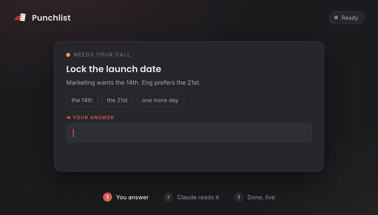

<p align="center">
  
</p>

<h1 align="center">📋 Punchlist</h1>

<p align="center"><b>A live checklist you and your coding agent fill out together.</b></p>

<p align="center">Your agent writes the questions. You answer them in a beautiful browser UI — at your own pace. It reads them back and gets to work, and you watch the results land <i>live</i>.</p>

<p align="center">
  
</p>

---

## The problem

You're working with a coding agent (Claude Code, Cursor, whatever). It stops and hits you with **the wall of questions**:

> Close these 6 tickets? Which DB for the cache? Here are 9 findings — which do you want fixed? Pick a name for the service. Also—

A chat box is a miserable place to answer that. Replies get tangled ("yes to 1 and 3, no to 4, skip 2…"), you can't sit on the hard one for an hour without blocking everything, and two messages later you're scrolling up asking "wait, what was #4?"

**A batch of decisions isn't a conversation. It's a list.** So make it one.

## The fix

Your agent writes a markdown punchlist. You open it in Punchlist and work it like a form — tick boxes, type answers, click option chips, leave the hard ones blank. Then you say **"check it out"** and the agent reads your answers, does the work, and annotates each item with what it did.

The magic: **it's live both ways.**

```
  YOU                          PUNCHLIST (browser)                 YOUR AGENT
  type an answer  ───────────▶  autosaves to the .md  ───────────▶  reads it
  watch it update  ◀───────────  re-renders in ~1s    ◀───────────  writes results
```

No copy-paste. No terminal ping-pong. No re-reading raw markdown. You see the agent work in real time. It's the human-in-the-loop UI that coding agents have been missing.

## Add it as a Claude Code skill

This is where it shines. Three commands:

```bash
git clone https://github.com/rmtbb/punchlist.git ~/punchlist
mkdir -p ~/.claude/skills/punchlist
ln -s ~/punchlist/skill/SKILL.md ~/.claude/skills/punchlist/SKILL.md
```

Restart Claude Code, then just ask: **"make me a punchlist for X"** (or type `/punchlist`). Claude generates the list, opens it in your browser, and waits. You fill it in, say **"check it out,"** and watch it run. That's the whole loop.

> Works with any agent that can write a markdown file — the skill just makes Claude Code drive it automatically.

## Or use it solo (no agent)

It's a great personal checklist on its own:

```bash
open ~/punchlist/index.html      # or just double-click it
```

Click **Open a file**, pick any markdown checklist, and start ticking. Your edits save straight back to the file.

## What it understands

Plain markdown, plus a few light conventions:

| You write | You get |
|---|---|
| `## 🔴 Section` | a collapsible section (the emoji sets the accent color) |
| `### Item` | an item card |
| `➡️ YOU:` | an editable answer field that writes back |
| `- [ ] task` | a checkbox that writes back |
| `- Options: ` `` `yes` `` ` / ` `` `no` `` | clickable chips that fill the answer |

```markdown
### Lock the launch date
Marketing wants the 14th; eng prefers the 21st.
- Options: `the 14th` / `the 21st` / `one more day`

➡️ YOU:
```

Edit it in the app, in Obsidian, in any editor — same file, same format. Mix freely.

## Why it's nice

- ⚡ **Live two-way sync** — your answers flow in, the agent's results flow out, both visible instantly.
- 🩹 **Surgical** — only the answer lines and checkboxes are rewritten; your prose, headings, and tables are never touched.
- 🎨 **Themeable** — presets, custom colors, your own logo. Make it yours in thirty seconds.
- 🔒 **Private & local** — one HTML file, no build, no server, no account, no analytics. Your data never leaves your machine. (Web fonts are an optional, off-by-default toggle — the only thing that ever calls out.)

## License

[MIT](LICENSE) © Remote BB. Do whatever you want with it.

---

<sub>Made because answering a robot's twenty questions in a chat box is a special kind of pain. 📋</sub>
